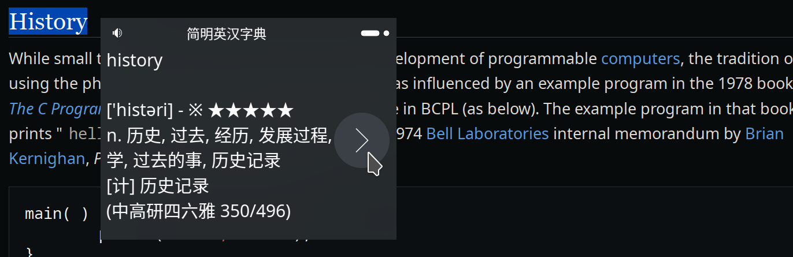

[简体中文](./README.zh-CN.md)

#  PopTranslate
PopTranslate is a translator running under wayland, which can translate the text selected by the mouse and display the result in a pop-up window (only Plasma Wayland is currently supported)

# Why write yet another translator?
GoldenDict, Crow Translate and other translation software are very useful, but due to the wayland protocol restrictions, they cannot register global shortcut keys, and cannot read the clipboard and mouse position in the background (resulting in the inability to pop up a window near the mouse and translate)
# Screenshots





# Global Shortcuts
`Meta + G` or `Meta + Ctrl + G` to translate the text selected by the mouse and display a popup window.

# Installation
## Arch Linux (AUR)
```bash
paru -S poptranslate
```

## Kubuntu
Get deb package from [release page](https://github.com/glaumar/PopTranslate/releases)

## Other (Flatpak)
Get flatpak package from [release page](https://github.com/glaumar/PopTranslate/releases)

# Dependencies
- [CMake](https://cmake.org/) >= 3.26
- [Qt](https://www.qt.io/) >= 5.15
- [Extra CMake Modules](https://github.com/KDE/extra-cmake-modules)
- [KDE Frameworks](https://api.kde.org/frameworks/index.html) >= 5.108 with at least the following modules:
    - KGlobalAccel
    - KGuiAddons
    - KWayland
    - KWindowSystem
    - KWidgetsAddons
    - KXmlGui
- [QOnlineTranslator](https://github.com/crow-translate/QOnlineTranslator) - provides free usage of Google, Yandex and Bing translate API
- [Tesseract OCR](https://github.com/tesseract-ocr/tesseract) >= 5.0.0
- [tessdata](https://github.com/tesseract-ocr/tessdata) 


## Flatpak Runtime and SDK
- org.kde.Platform = "5.15-22.08"
- org.kde.Sdk = "5.15-22.08"

# Build

## CMake
### Build
```bash
cmake -B build -DCMAKE_INSTALL_PREFIX=/usr
cmake --build build --target poptranslate
```

### Generate deb package
```bash
cd build && cpack -C CPackConfig.cmake
```

## Flatpak

### Install runtime and sdk
```bash
flatpak install org.kde.Platform/x86_64/5.15-22.08
flatpak install org.kde.Sdk/x86_64/5.15-22.08
```

### Build 
```bash
flatpak-builder build_flatpak  io.github.glaumar.PopTranslate.yml --force-clean
```

### Generate flatpak package
```bash
flatpak build-export export build_flatpak

flatpak build-bundle export PopTranslate.flatpak io.github.glaumar.PopTranslate --runtime-repo=https://flathub.org/repo/flathub.flatpakrepo
```

## Generate pacman package
```bash
git clone https://aur@aur.archlinux.org/poptranslate.git 
cd poptranslate && makepkg -s
```