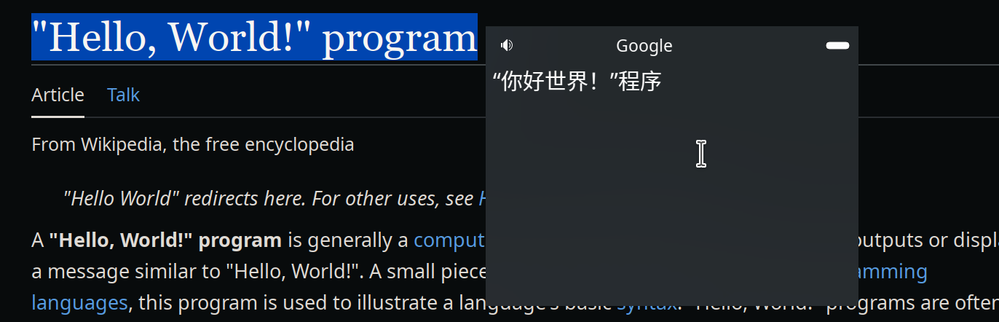

#  PopTranslate
PopTranslate 是一个运行在 wayland 下的翻译器,能够翻译鼠标选中的文本并在弹出窗口中显示结果(目前仅支持 Plasma Wayland)

# 为什么要造轮子?
GoldenDict, Crow Translate等等翻译软件都很好用,但由于 wayland 协议限制,他们在 wayland 下无法注册全局快捷键,无法在后台读取剪贴板和鼠标位置(导致无法在鼠标附近弹出窗口并翻译)
# 应用截图




# 全局快捷键
`Meta + G` or `Meta + Ctrl + G` 翻译鼠标选中的文本并显示弹出窗口

# 安装
## Arch Linux (AUR)
```bash
paru -S poptranslate
```
# 依赖
- [CMake](https://cmake.org/) >= 3.5
- [Extra CMake Modules](https://github.com/KDE/extra-cmake-modules)
- [Qt](https://www.qt.io/) >= 5.15
- [KDE Frameworks](https://api.kde.org/frameworks/index.html) >= 5.108 并至少包含以下模块:
    - KGlobalAccel
    - KGuiAddons
    - KWayland
    - KWindowSystem
    - KWidgetsAddons
    - KXmlGui
- [QOnlineTranslator](https://github.com/crow-translate/QOnlineTranslator) - 提供 Google, Yandex 和 Bing 的翻译 API
## Flatpak 运行时和 SDK
- org.kde.Platform = "5.15-22.08"
- org.kde.Sdk = "5.15-22.08"

# 使用 Flatpak 本地编译并安装

## 安装运行时和 SDK
```bash
flatpak install org.kde.Platform/x86_64/5.15-22.08
flatpak install org.kde.Sdk/x86_64/5.15-22.08
```

## 编译并安装
```bash
flatpak-builder build-dir io.github.glaumar.PopTranslate.yml --force-clean --user --install
```